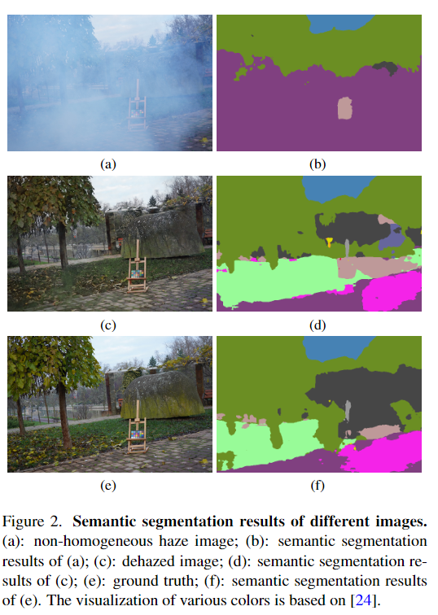

 # Semantic-Guidance-Dehazing
 NTIRE 2023 HR NonHomogeneous Dehazing Challenge: (CVPR Workshop 2023) Solution.

High-resolution non-homogeneous dehazing aims to generate a clear image from a 4000 x 6000 image with
non-homogeneous haze. To address this issue, we propose semantic guided loss functions for high-resolution non-homogeneous dehazing. Semantic information contains strong texture and color prior. Thus, we proposed to adopt the pre-trained model to generate the semantic mask to guide the
neural network during the training phase.
<p align="center"></p>


[Paper](https://openaccess.thecvf.com/content/CVPR2023W/NTIRE/papers/Yang_Semantic_Guidance_Learning_for_High-Resolution_Non-Homogeneous_Dehazing_CVPRW_2023_paper.pdf), [CVPRW2023, Accepted]

### Testing
#### 1. Cloning the repository
```bash
$ git clone https://github.com/dectrfov/Semantic-Guidance-Dehazing.git
$ cd Semantic-Guidance-Dehazing
```
#### 2. Download the pre-trained [model](https://drive.google.com/file/d/1hCmfTjUUdVCCdb0-5U17xwXyIVleM7Wf/view?usp=sharing) and testing images

Put model weights into codes/weights/ <br />
Put images into codes/tests/ <br />

#### 3. Prepare environment & dependency
    torch	      1.13.1
    torchvision 0.14.1
    opencv 	    4.4.0
    numpy       1.23.5
    pillow      9.3.0
    tqdm        4.64.1


#### 4. Testing
```bash
    cd codes/code
    python test.py test_data_path $[path of testing dataset]
```
### Dehazed Images

[Validation](https://drive.google.com/file/d/1VOzaeJ5tL5mC2eb-c-ZEb6wzCJDuyA6V/view?usp=sharing) are dehazed images from NTIRE 2023 HR NonHomogeneous Dehazing Challenge validation dataset.
[Testing](https://drive.google.com/file/d/1PcMq89rlQHL8yQHIiloB-esWuf_2pl2g/view?usp=sharing) are dehazed images from NTIRE 2023 HR NonHomogeneous Dehazing Challenge testing dataset.


# Citations
Please cite this paper in your publications if it is helpful for your tasks:    

Bibtex:
```
@inproceedings{yang2023semantic,
  title={Semantic Guidance Learning for High-Resolution Non-Homogeneous Dehazing},
  author={Yang, Hao-Hsiang and Chen, I and Hsieh, Chia-Hsuan and Chang, Hua-En and Chiang, Yuan-Chun and Chen, Yi-Chung and Huang, Zhi-Kai and Chen, Wei-Ting and Kuo, Sy-Yen and others},
  booktitle={Proceedings of the IEEE/CVF Conference on Computer Vision and Pattern Recognition},
  pages={1447--1455},
  year={2023}
}
```
